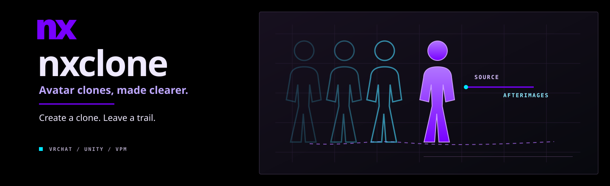

<p align="center">
  
</p>

<p align="center">
  <code>0.3.2 preview</code> &nbsp; <code>Unity 2022.3</code> &nbsp; <code>PC VRChat</code> &nbsp; <code>VPM</code>
</p>

nxclone is a source-first editor helper for VRChat avatar clones. It checks avatar requirements before generating a scene copy with optional translucent afterimages and independent FX toggles assembled during upload. It does not ask you to log in or contact a license server.

<h2 align="center"><a href="https://nerdrx.github.io/nxclone/#install">Install nxclone</a></h2>
<p align="center">
  ALCOM / Creator Companion<br /><br />
  <a href="https://github.com/nerdrx/nxclone/releases/tag/v0.3.2">Download preview</a> &nbsp;·&nbsp;
  <a href="docs/INSTALL.md">Installation help</a>
</p>

Add the nxclone repository, then install **nxclone** in your avatar project. The current preview is **0.3.2**.

<details><summary>Manual VPM repository URL</summary>

```text
https://nerdrx.github.io/nxclone/index.json
```

</details>

---

## Features

| Feature | Controls |
| :--- | :--- |
| Clone layout | Up to four sources, root/bone/custom anchors, position and rotation offsets, scale, mirror, presets and scene handles. Empty source and anchor fields use the avatar root. |
| Visibility | Clones start hidden. Master visibility, individual enable switches and afterimages have separate controls. |
| Placement | Unity position/rotation fields and scene handles; optional in-game XYZ position and pitch/yaw/roll rotation dials. World drop holds position, rotation and scale; turning it off resumes the selected anchor. |
| Pose | Whole-body freeze, grabbable limbs, optional limb IK and remote hand/foot contact attachment. |
| Recording | Sampled body, hips and world movement with record, replay and speed controls. Independent clone FX adds gesture/expression snapshots. |
| Expressions | Visual FX mirroring, copied external controllers and menus, optional independent self-clone controllers and transition locks. Main-avatar built-ins remain read-only. |
| Wear | Select one clone as the visible body, hide the original renderers, then return to the original FX controls. |
| Afterimages | Flat transparent silhouettes with shared or per-afterimage colours, primary-body masking, camera proximity fade, independent toggle and optional gesture command. |
| Setup | Missing FX/menu/parameter assets created on a scene copy. Full menus wrap and paginate. Optional VRCFury parameter compression with a final upload budget check. |

## Avatar requirements

- Scene avatar with a VRC Avatar Descriptor, valid humanoid Animator and skinned meshes.
- Each source needs a humanoid rig and mesh bones inside its hierarchy. Standard humanoid bones can map across differently named rigs. Unmatched accessory bones produce a warning.
- Enough synced parameter space for selected controls; the check explains shortages. Missing expression assets are created automatically. Existing menu controls are preserved.
- PC shader support for afterimages. A separate mobile shader would be needed for Quest.

Open **Tools → nxclone**, select the original avatar, configure options and choose **Generate scene copy**. Final extraction runs after VRCFury Armature Link during SDK preprocessing, then before VRCFury parameter compression. **Regenerate from the original avatar after updating an older nxclone version.** Existing uploaded avatars do not change automatically.

## Control costs and limits

| Option | Synced bits |
| :--- | ---: |
| Master visibility | 1 |
| Individual enable / world drop / freeze / posing / IK | 1 per selected control per clone |
| Afterimage visibility | 1 |
| Scale dial | 8 |
| Position dials | 24 per clone |
| Rotation dials | 24 per clone |
| Body record + replay + speed | 10 per clone |
| Wear selector | 8 total |
| Contact attachment | 1 per tracker; seven tracking inputs remain local |
| Gesture commands / expression snapshot buffers | 0 additional |

Copied source-menu parameters and FX transition locks add their own cost. **Defer parameter limit to VRCFury** requires VRCFury; upload is still rejected if the final cost exceeds 256 bits. Recording supports up to 15 samples, reduced to reserve sources for world contact attachment and wear. More samples, meshes and trackers increase avatar cost.

## Behavior and compatibility

- New clones default to 1 m forward from the avatar root, facing back toward it (180° yaw). Use **At anchor** for zero offset. Existing saved layouts retain their placement. Bone anchors apply offsets in the selected anchor's frame. Position dials adjust ±2 m per axis around the configured placement; 0.5 is neutral. Rotation dials add ±180° of pitch, yaw and roll to the configured orientation, in that order around successive local axes. Rotation does not change the configured placement position.
- Afterimages follow the main avatar with zero placement offset. Each trail follows the full render rig, including armature ancestors. Newer trails blend over older ones; the primary silhouette masks every trail. Nearby fragments fade between 0.25 and 0.6 m from the camera. Afterimage lag uses constraint feedback, so it varies with frame rate. It is not a fixed millisecond delay.
- Afterimages are geometry silhouettes: textures, cutout holes and material displacement are not reproduced. Stencil bits 0 through 4 are reserved; opaque scene depth still occludes them.
- Independent FX requires transferable animation bindings. If a source clip animates a component removed from clone visuals, generation names the clip and track and explains how to disable or remove it.
- Presets store settings; scene source and custom-anchor references must be reselected.
- Remote contacts need avatar interaction permissions. Built-in body tags such as HandL and FootR are normally generated on humanoid avatars; custom tags require matching senders. [VRChat contact tags](https://creators.vrchat.com/common-components/contacts/built-in-contact-tags/).

## Validation

Linux Unity 2022.3.22f1 tests cover native constraint movement/drop, pose ownership, capture/replay/recapture, menu composition, FX remapping and VRCFury preprocessing/compression. SDK stubs expose FinalIK, parameter-driver and layer-control serialization; their VRChat runtime behavior still needs an in-game check. Windows and live multi-user VRChat remain unverified. [Detailed checks and remaining limits](docs/PARITY.md).

Editor code is independent and MIT licensed. Bundled VRLabs Contact Tracker assets retain their MIT license. Purchased packages, vendor DLLs and avatar assets are excluded from distribution. [Package manifest](Packages/dev.nx.nxclone/package.json) · [Report an issue](https://github.com/nerdrx/nxclone/issues).
